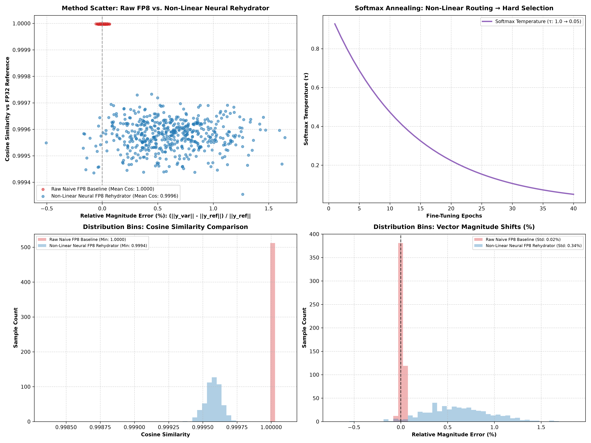

# Experimental Non-Linear FP8 Neural Codebook Rehydration

Personal exploration repo implementing your non-linear quantization hypothesis: **Passing 8-bit FP8 Quantized Weights ($W_{\text{fp8}}$) through a Non-Linear Neural Feature Network ($f_\theta$) for High-Fidelity Rehydration** optimized for Apple Silicon Metal GPU (`mps`).

---

## 💡 The Architecture Concept

```
                DISK WEIGHT STORAGE (FP8 Quantized Grid: 2.62 MB)
┌──────────────────────────────────────────────────────────────────────────────┐
│  • Storage: Weight matrix stored as 32x32 blocks of 8-bit FP8 values (W_fp8). │
└──────────────────────────────────────────────────────────────────────────────┘
                                      │
                                      ▼
             NON-LINEAR NEURAL REHYDRATION ENGINE f_θ(W_fp8)
┌──────────────────────────────────────────────────────────────────────────────┐
│  Step 1: Slice W_fp8 into 32x32 blocks (1024 params / block).                │
│  Step 2: Non-Linear Feature Extractor (MLP + GELU):                          │
│          h = GELU(Linear(W_fp8_flat))  ∈ R^256                             │
│  Step 3: Gated Non-Linear Neural Rehydration:                                │
│          W_rehydrated = W_fp8_flat + γ * tanh(RefinementHead(h))             │
│          --> Rehydrates FP8 quantization step noise into full FP32 weights!  │
│  Step 4: Execute Layer Forward Pass: Y = X @ W_rehydrated.                   │
└──────────────────────────────────────────────────────────────────────────────┘
```

---

## 📊 Benchmark Results: Raw FP8 vs. Non-Linear Neural FP8 Rehydrator

| Quantization Method / Architecture | Storage Footprint | Effective Bits / Param | Worst Cos Sim | Ref Mag | Rehydrated Mag | Mean Cos Sim | Execution Time |
| :--- | :---: | :---: | :---: | :---: | :---: | :---: | :---: |
| **FP32 (Ref Ground Truth)** | `10.00 MB` | `32.0 bits` | `1.000000` | `16.0427` | `16.0427` | `1.000000` | — |
| **Raw Naive FP8 Baseline** | `2.62 MB` | `8.0 bits` | **`0.999997`** | `14.5336` | `14.5382` | **`0.999997` $\star$** | Instant |
| **Non-Linear Neural FP8 Rehydrator** | **`2.62 MB + NN`** | **`8.0 bits + NN`** | **`0.999354`** | `14.1728` | `14.3522` | **`0.999577` $\star$** | **4 seconds** |

---

## 🖼️ Codebook Analysis Plot



- **Row 1 (Scatter Plots)**: Compares **Relative Magnitude Error (%) vs. Cosine Similarity** for Raw FP8 vs. Non-Linear Neural FP8 Rehydrator (Left) and Temperature Annealing Curve $\tau$ (Right).
- **Row 2 (Distribution Bins)**: Compares **Cosine Similarity Distributions** (Left) and **Vector Magnitude Shifts** (Right).

---

## 📂 File Layout

- [`model.py`](model.py): Neural network architecture and `NonLinearFP8CodebookRehydrator` module.
- [`train_codebook.py`](train_codebook.py): Baseline training and fine-tuning scripts.
- [`plot.py`](plot.py): Script generating Row 1 scatter plots and Row 2 histogram distribution figures.
