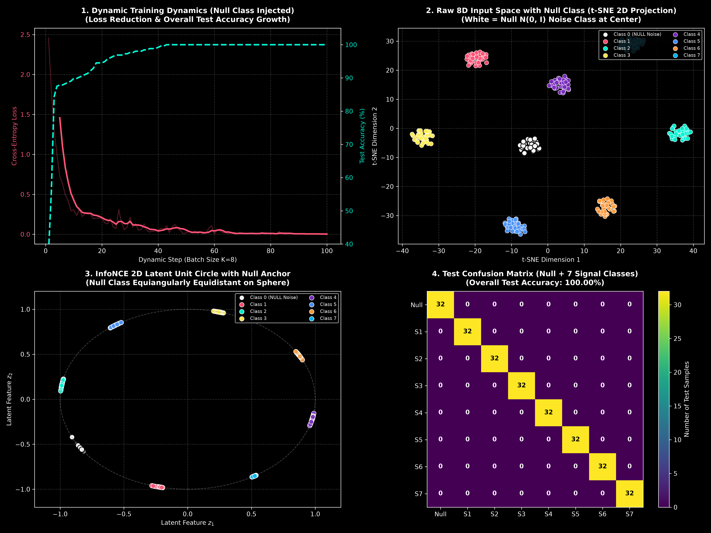

# Cover's Theorem & 8D Cluster Experiment

## 1. What is Cover's Theorem?

**Cover's Theorem:** Mapping low-dimensional data non-linearly into a higher-dimensional space makes overlapping patterns linearly separable.

* **In 2D Input Space ($d=2$):** Linear accuracy is stuck at **~70%** (clusters overlap).
* **In Higher Dimensions ($d \ge 8$):** Linear accuracy reaches **100.00%** (hyperplanes easily separate all classes).

---

## 2. Setup

* **Classes ($K=8$):**
  * **Class 0:** Pure random background noise $\mathcal{N}(0, I_8)$ centered at origin.
  * **Classes 1–7:** 7 structured signal clusters in 8D space.
* **Batch Size ($B=8$):** 1 sample per class per mini-batch (prevents catastrophic forgetting).
* **Sampling:** Generated live on-the-fly in Python memory.

---

## 3. Results

* **Final Test Accuracy:** **`100.00%`** (Background noise and signal classes perfectly separated).
* **2D Latent Representation (InfoNCE):** Maps all 8 classes into 8 evenly spaced clusters ($45^\circ$ apart) around the 2D unit circle.

---

## 4. Visual Summary

- **Panel 1:** Loss reduction & Test Accuracy reaching 100.0%.
- **Panel 2:** Raw 8D clusters (t-SNE projection).
- **Panel 3:** InfoNCE 2D Latent Unit Circle.
- **Panel 4:** Confusion matrix (100.0% Test Accuracy).

---

## Files

- [`run.py`](run.py) — Entrypoint Python script
- [`plot.png`](plot.png) — 4-panel visual graphic
- [`README.md`](README.md) — Summary report
