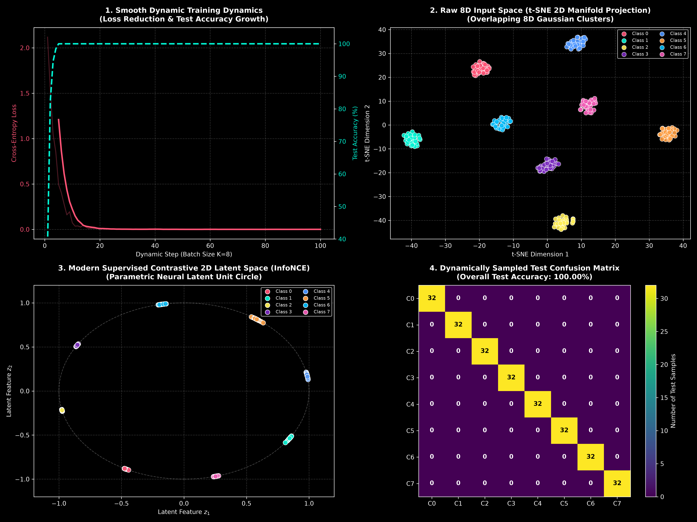

# Modern High-Dimensional Dynamic On-The-Fly Cluster Experiment

This experiment implements **Dynamic On-The-Fly Data Generation**, **Balanced Mini-Batch Training**, and **Modern 2D Representation Learning (Supervised Contrastive Learning / InfoNCE)** in an 8-dimensional space ($d_{\text{in}} = 8$):

---

## 1. System Specifications

* **Number of Classes ($K$):** $K = 8$ (Power of 2: $2^3 = 8$).
* **Input Feature Dimension ($d_{\text{in}}$):** $d_{\text{in}} = 8$ dimensions.
* **On-The-Fly Dynamic Generation:** No pre-stored static dataset array. Class centroids $c_k \in \mathbb{R}^8 \sim \mathcal{N}(0, 3.0^2)$ and standard deviations $\sigma_k \in \mathbb{R}^8 \sim |\mathcal{N}(0.6, 0.25)|$ are stored in memory. Mini-batches are generated dynamically on demand.
* **Balanced Batching Strategy:** Batch size = $K = 8$ (exactly 1 instance per class per mini-batch).
* **Dynamically Generated Test Set:** $N_{\text{test}} = 8 \times 32 = 256$ samples generated on the fly.

---

## 2. Dynamic Training Dynamics Progression

| Step Range | Dynamic Mini-Batch Loss | Dynamic Test Accuracy (%) | Training State |
| :---: | :---: | :---: | :--- |
| **Step 1** | 2.1178 | 38.3% | Initial state |
| **Step 10** | 0.0722 | **100.0%** | Rapid convergence |
| **Step 20** | 0.0028 | **100.0%** | Loss target threshold met (< 0.005) |
| **Step 50** | 0.0006 | **100.0%** | High precision stability |
| **Step 100** | 0.0005 | **100.0%** | Final convergence plateau |

---

## 3. Modern 2D Dimensionality Reduction & Representation Learning

Instead of legacy linear projections (like PCA), we implemented two state-of-the-art representation visualization techniques:

1. **Modern Supervised Contrastive / Parametric 2D Latent Representation Encoder (SupCon / InfoNCE):**
   * A neural network encoder $E_\theta: \mathbb{R}^8 \rightarrow \mathbb{S}^1$ trained using **Supervised Contrastive Loss (InfoNCE)**.
   * Maps 8D input clusters onto a normalized 2D unit circle ($\mathbb{S}^1$), pulling instances of the same class into tight 2D clusters while pushing different classes far apart.
2. **t-SNE (t-Distributed Stochastic Neighbor Embedding):**
   * Non-linear manifold learning projecting the 8D overlapping Gaussian clusters into 2D.

---

## 4. Visual Graphic

- **Panel 1:** Smooth dynamic training dynamics showing Cross-Entropy Loss reduction (Red curve) and Test Accuracy growth (Cyan dashed curve jumping to 100.0%).
- **Panel 2:** t-SNE 2D manifold projection of the raw 8D input clusters.
- **Panel 3:** **Modern Supervised Contrastive 2D Latent Unit Circle (InfoNCE)** showing the 8 classes cleanly organized around a 2D hypersphere.
- **Panel 4:** Confusion matrix on 256 dynamically sampled unseen test points (100.00% Test Acc).

---

## Files

- [`dynamic_highd_experiment.py`](dynamic_highd_experiment.py) — Python script for dynamic on-the-fly 8D experiment
- [`dynamic_highd_story.png`](dynamic_highd_story.png) — Generated 4-panel visual graphic
- [`README.md`](README.md) — Experiment documentation report
