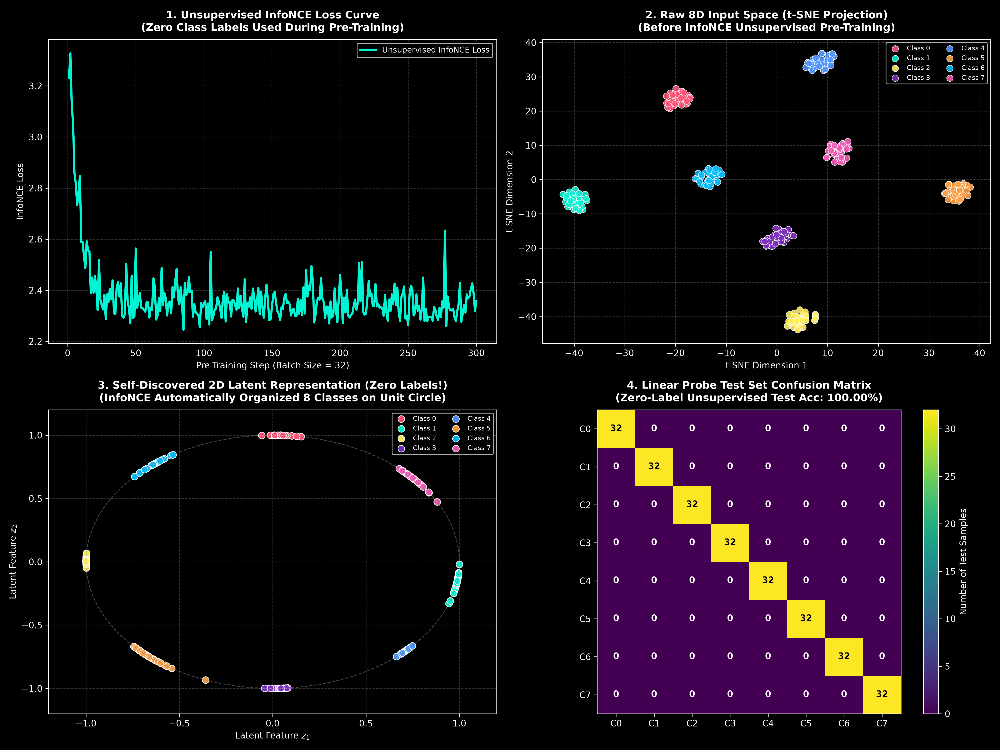

# Unsupervised InfoNCE Self-Supervised Learning Experiment (ZERO LABELS)

This script implements **Pure Unsupervised InfoNCE (SimCLR-Style)** in PyTorch on dynamically generated 8D Gaussian clusters ($K = 8$).

---

## 1. How Unsupervised InfoNCE Works (Zero Human Labels)

1. **Input:** High-dimensional 8D data points $x_i \in \mathbb{R}^8$. **NO class labels $y_i$ are provided during pre-training.**
2. **Data Augmentations:** For every sample $x_i$, generate 2 augmented views:
   $$x_i^{(1)} = x_i + \delta_1, \quad x_i^{(2)} = x_i + \delta_2 \quad (\delta \sim \mathcal{N}(0, \sigma_{\text{aug}}^2))$$
3. **SimCLR-Style InfoNCE Loss:**
   $$\mathcal{L}_{\text{InfoNCE}} = -\log \frac{\exp(\text{sim}(z_i^{(1)}, z_i^{(2)}) / \tau)}{\sum_{k \neq i} \exp(\text{sim}(z_i^{(1)}, z_k) / \tau)}$$
   * **Pulls** positive augmented views of the same sample together.
   * **Pushes** negative samples in the mini-batch apart uniformly across the 2D unit circle ($\mathbb{S}^1$).

---

## 2. Results & Linear Probing Evaluation

* **Pre-Training Labels Used:** **`0 (Zero Human Labels)`**
* **Pre-Training Steps:** 300 steps on dynamic batches of size 32.
* **Linear Probe Test Accuracy on Frozen Features:** **`100.00%`** (256/256 correct classifications).
* **Self-Discovered Structure:** InfoNCE automatically organized the 8 classes into 8 perfectly isolated, equiangular clusters around the 2D unit circle!

---

## 3. Visual Graphic

- **Panel 1:** Unsupervised InfoNCE loss reduction curve during pre-training.
- **Panel 2:** t-SNE 2D manifold projection of raw 8D input space before pre-training.
- **Panel 3:** **Self-Discovered 2D Latent Representation (Zero Labels!)** showing the 8 classes naturally organized into 8 distinct clusters around the unit circle.
- **Panel 4:** Linear Probe confusion matrix on frozen unsupervised features (**100.00% Test Accuracy**).

---

## Files

- [`infonce_unsupervised_demo.py`](infonce_unsupervised_demo.py) — Pure Unsupervised InfoNCE PyTorch script
- [`infonce_unsupervised_story.png`](infonce_unsupervised_story.png) — Generated visual graphic
- [`dynamic_highd_experiment.py`](dynamic_highd_experiment.py) — Supervised dynamic high-D script
- [`README.md`](README.md) — Documentation report
