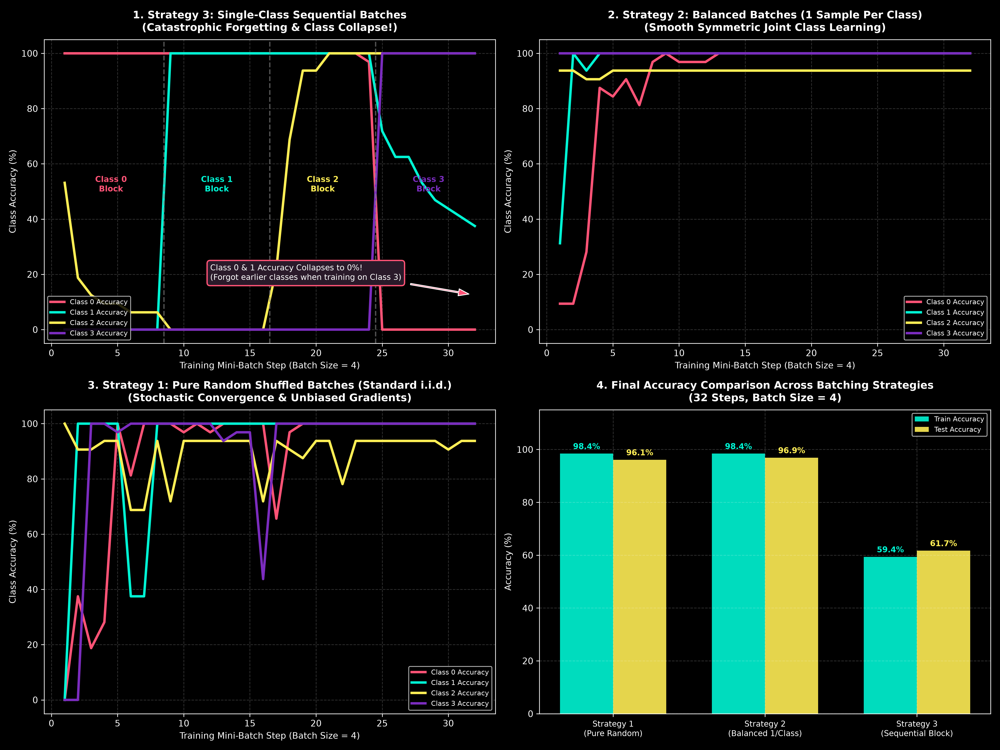

# Cover's Theorem & Training Batch Dynamics Experiment

This directory evaluates **Cover's Theorem**, **Generalization**, and **Batching Strategies** (Batch Size = 4) across 4 classes:

---

## 1. The 3 Batching Strategies (Batch Size = 4)

1. **Strategy 1: Pure Random Shuffled (Standard i.i.d.)**
   * Batches of 4 are sampled uniformly at random from the dataset.
   * Gives unbiased, stochastic gradient estimates.
2. **Strategy 2: Balanced / Stratified (Exactly 1 Instance Per Class Per Batch)**
   * Every batch contains **exactly 1 sample from Class 0, Class 1, Class 2, and Class 3**.
   * Forces the network to update decision boundaries for all 4 classes simultaneously in every step.
3. **Strategy 3: Single-Class Sequential (Block Batching)**
   * Batch 1-8: **All 4 samples are Class 0**.
   * Batch 9-16: **All 4 samples are Class 1**.
   * Batch 17-24: **All 4 samples are Class 2**.
   * Batch 25-32: **All 4 samples are Class 3**.

---

## 2. Empirical Performance Comparison

| Batching Strategy | Final Train Accuracy (%) | Final Test Accuracy (%) | Training Dynamics & Behavior |
| :--- | :---: | :---: | :--- |
| **Strategy 1: Pure Random** | **98.4%** | **96.1%** | Smooth stochastic convergence. |
| **Strategy 2: Balanced (1/Class)** | **98.4%** | **96.9%** | **Fastest, cleanest joint convergence.** All 4 classes learned symmetrically. |
| **Strategy 3: Single-Class Sequential** | **59.4%** | **61.7%** | **Catastrophic Forgetting & Class Collapse!** Overwrites previous class weights. |

---

## 3. Visual Graphic

- **Panel 1 (Single-Class Sequential):** Shows per-class accuracy over 32 steps. When training on Class 3 in steps 25-32, the accuracy for Class 0 and Class 1 **collapses to 0%** (Catastrophic Forgetting).
- **Panel 2 (Balanced 1-per-Class):** Shows all 4 class accuracies smoothly remaining near 100% throughout all 32 steps.
- **Panel 3 (Pure Random):** Shows stochastic class learning without catastrophic forgetting.
- **Panel 4 (Final Accuracy Bar Chart):** Compares final Train & Test accuracy across all 3 strategies.

---

## Files

- [`batch_dynamics_experiment.py`](batch_dynamics_experiment.py) — Python script for 3-strategy batch experiment
- [`batch_dynamics_story.png`](batch_dynamics_story.png) — Generated visual graphic
- [`covers_4class_experiment.py`](covers_4class_experiment.py) — Python script for Cover's theorem 4-class experiment
- [`covers_4class_story.png`](covers_4class_story.png) — Generated Cover's theorem graphic
- [`README.md`](README.md) — Documentation report
