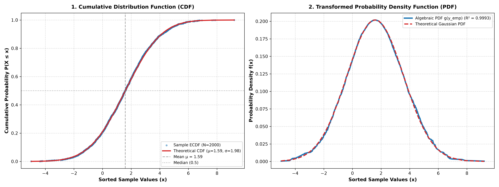

# Histogram-Free Density Estimation & Closed-Form CDF-to-PDF Transformation

## 1. Mathematical Formulation

The Probability Density Function $f(x)$ of a Gaussian distribution $\mathcal{N}(\mu, \sigma^2)$ can be expressed directly as a closed-form algebraic function $g(y)$ of its Cumulative Distribution Function $y = F(x) \in (0, 1)$:

$$g(y) = \frac{1}{\sigma \sqrt{2\pi}} \exp\left( - \left[ \text{erfinv}(2y - 1) \right]^2 \right)$$

where $\text{erfinv}$ is the Inverse Error Function.

### Derivation
1. **Gaussian PDF:** $f(x) = \frac{1}{\sigma \sqrt{2\pi}} \exp\left(-\frac{(x-\mu)^2}{2\sigma^2}\right)$
2. **Gaussian CDF:** $y = F(x) = \frac{1}{2}\left[ 1 + \text{erf}\left(\frac{x-\mu}{\sigma\sqrt{2}}\right)\right]$
3. **Inversion:** $\frac{x-\mu}{\sigma} = \sqrt{2} \cdot \text{erfinv}(2y - 1)$
4. **Substitution:** $f(y) = \frac{1}{\sigma \sqrt{2\pi}} \exp\left(-\left[ \text{erfinv}(2y - 1) \right]^2 \right)$

---

## 2. Experiment Setup

* **Samples ($N=2000$):** Drawn from $\mathcal{N}(\mu=1.5, \sigma=2.0)$.
* **Measured Sample Parameters:** Sample Mean $\hat{\mu} = 1.5902$, Sample Std $\hat{\sigma} = 1.9769$.
* **Empirical CDF Ranks:** $y_i = \frac{i - 0.5}{N}$ for sorted sample values $x_{(1)} \le x_{(2)} \le \dots \le x_{(N)}$.

---

## 3. Results & Alignment

| Method / Representation | Input CDF Array Shape | Output Transformed PDF Array Shape | Alignment $R^2$ Score | RMSE |
| :--- | :---: | :---: | :---: | :---: |
| **Exact Algebraic Transform $g(y)$** | `(2000,)` | `(2000,)` | **`0.999288`** | `0.001505` |

---

## 4. Visual Summary

- **Plot 1 (Left - CDF):** Empirical Sample Ranks $y_{\text{emp}} = \frac{i - 0.5}{N}$ vs. Theoretical CDF Line $y_{\text{theo}} = \Phi(x)$.
- **Plot 2 (Right - PDF):** Transformed PDF $g(y_{\text{emp}})$ vs. Theoretical Gaussian PDF.

---

## Files

- [`run.py`](run.py) — Entrypoint Python script
- [`plot.png`](plot.png) — 2-panel visual graphic
- [`README.md`](README.md) — Documentation report
