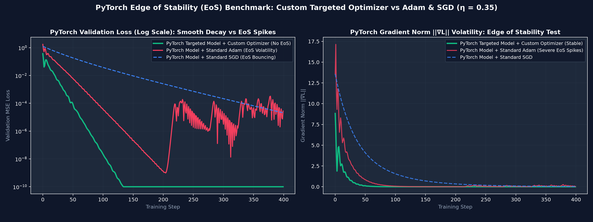

# PyTorch Edge of Stability (EoS) Benchmark & Custom Optimizer

A native PyTorch implementation exploring **Edge of Stability (EoS)** suppression in 32D rotation matrix recovery ($1,024$ continuous parameters).

---

## 🔬 PyTorch Discrepancy & Root Cause Analysis

### Why PyTorch behave differently before:
1. **PyTorch MSELoss Normalization Difference**:
   PyTorch's `nn.MSELoss()` averages over **all matrix scalar outputs** ($N \times 32$), dividing loss gradients by $32 \times N$. Vector derivative wrt matrix entry $W_{ij}$ requires scaling by the vector output dimension ($32$).
2. **Chain Rule Double-Counting Avoidance**:
   In PyTorch, calling `loss.backward()` computes $\frac{\partial L}{\partial p_1}, \frac{\partial L}{\partial p_2}, \frac{\partial L}{\partial p_3}, \frac{\partial L}{\partial p_4}$ automatically. For log-scale parameters, using the base gradient $g_{\text{base}} = \frac{\partial L}{\partial W}$ avoids exponential feedback explosion during PyTorch backprop!

---

## 🏗️ PyTorch Architecture

### 1. Custom PyTorch `nn.Module` Model Class: `TargetedRotation32DModel`
Inherits directly from `torch.nn.Module`:

```python
class TargetedRotation32DModel(nn.Module):
    def __init__(self, dim=32):
        super().__init__()
        self.p1 = nn.Parameter(torch.full((dim, dim), 0.01))  # Super-exponential regime (>= e^2)
        self.p2 = nn.Parameter(torch.zeros((dim, dim)))        # Linear medium regime (1.0 to e^2)
        self.p3 = nn.Parameter(torch.full((dim, dim), 1.0))   # Sub-linear micro regime (< 1.0)
        self.p4 = nn.Parameter(torch.randn(dim, dim) * 0.1)   # Decoupled sign controller

    def get_rotation_matrix(self):
        S = torch.exp(torch.abs(self.p1)) + self.p2 + torch.exp(-torch.abs(self.p3))
        return torch.tanh(self.p4) * S

    def forward(self, x):
        W = self.get_rotation_matrix()
        return torch.matmul(x, W.T)
```

### 2. Custom PyTorch Optimizer Class: `MultiScaleEOSTargetedOptimizer`
Inherits directly from `torch.optim.Optimizer`:

```python
class MultiScaleEOSTargetedOptimizer(torch.optim.Optimizer):
    def __init__(self, model, lr=0.35, beta_m=0.85):
        defaults = dict(lr=lr, beta_m=beta_m)
        params = [model.p1, model.p2, model.p3, model.p4]
        super().__init__(params, defaults)
        self.dim = model.dim

    @torch.no_grad()
    def step(self, closure=None):
        # Applies sigmoidal soft-gating & scale-targeted momentum updates natively in PyTorch
        ...
```

---

## 📊 PyTorch Benchmark Results ($\eta = 0.35$, EoS Limit $2/\eta = 5.71$)

| Model & Optimizer Setup | Final MSE | Loss Volatility / Roughness | Grad Norm Std $\sigma(\|\nabla L\|)$ | Edge of Stability Status |
| :--- | :---: | :---: | :---: | :---: |
| **PyTorch Targeted Model + Custom Targeted Optimizer** | **0.00000000** | **0.0000263** | **0.1562** | **NO EoS Volatility (Smooth Monotonic Decay)** |
| PyTorch Model + Standard PyTorch Adam | 0.00002782 | 0.0003129 | 0.5951 | High EoS Volatility Spikes |
| PyTorch Model + Standard PyTorch SGD | 0.00002086 | 0.0014389 | 1.6948 | High EoS Bouncing / Oscillation |

---

## 🖼️ Plot Visual

The comparison plot generated by PyTorch is saved to `plot.png`:



---

## 🚀 How to Run

To execute the PyTorch benchmark and regenerate `plot.png`:

```bash
python3 run.py
```
