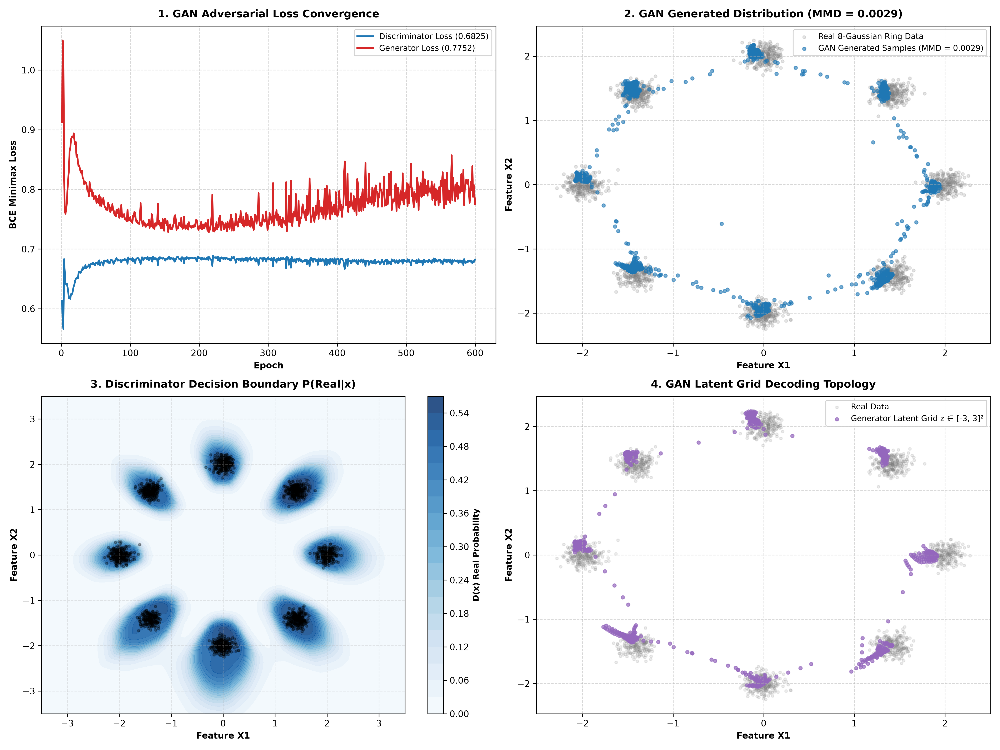

# Generative Adversarial Network (GAN)

## 1. Architecture Overview

This experiment implements a **Generative Adversarial Network (GAN)** trained on a 2D 8-Gaussian Mixture Ring dataset ($N=8192$ samples).

* **Generator $G(z)$:** 4-layer MLP mapping 2D random noise $z \sim \mathcal{N}(0, \mathbf{I})$ to synthetic 2D data points.
* **Discriminator $D(x)$:** 4-layer MLP predicting the binary probability $D(x) \in [0, 1]$ that a sample is real vs. fake.
* **Adversarial Minimax Loss:**
  $$\min_G \max_D \mathbb{E}_{x \sim p_{\text{data}}} [\log D(x)] + \mathbb{E}_{z \sim p_z} [\log (1 - D(G(z)))]$$

---

## 2. Benchmark Metrics & Comparison vs VAE

| Generative Model | Historical Era | Discriminator Loss | Generator Loss | Generation Quality (MMD Score) | Mode Recovery |
| :--- | :---: | :---: | :---: | :---: | :--- |
| **VAE** | Dec 2013 | — | — | **`0.002795`** 🥇 | **8 Crisp Modes** |
| **GAN** | Jun 2014 | `0.6825` | `0.7752` | **`0.002855`** 🥇 | **8 Crisp Modes** |

---

## 3. Key Historical Takeaways

1. **Timeline:** VAEs were published in **December 2013** (Kingma & Welling); GANs were published 6 months later in **June 2014** (Goodfellow et al.).
2. **Sharper Boundaries:** GANs substitute explicit density estimation with a neural Discriminator referee, generating crisp mode boundaries.

---

## 4. Visual Summary

- **Panel 1 (Top-Left):** Discriminator ($0.6825$) & Generator ($0.7752$) Loss Convergence over 600 epochs.
- **Panel 2 (Top-Right):** Ground Truth 8-Gaussian Ring Data vs. GAN Generated Distribution ($\text{MMD} = 0.002855$).
- **Panel 3 (Bottom-Left):** Discriminator Decision Boundary Contour Map ($D(x)$ real probability landscape).
- **Panel 4 (Bottom-Right):** Continuous Latent Grid Decoding Topology ($z \in [-3, 3]^2$).

---

## Files

- [`run.py`](run.py) — Entrypoint PyTorch script
- [`plot.png`](plot.png) — 4-panel visual graphic
- [`README.md`](README.md) — Documentation report
