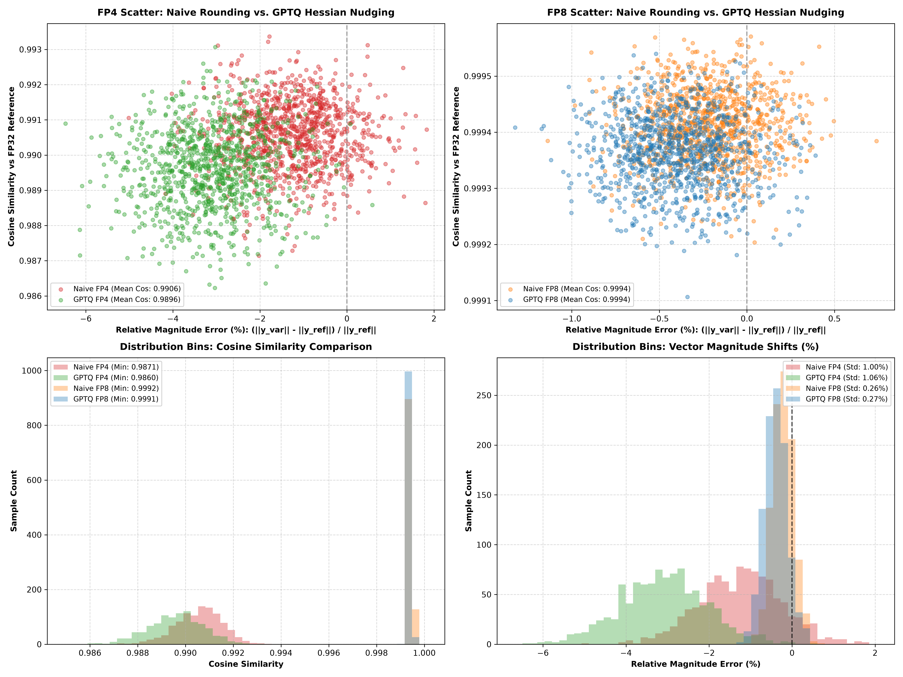

# GPTQ (Hessian-Guided) Quantization Experiments

Personal exploration repo analyzing post-training quantization comparing **Naive Round-To-Nearest (RTN)** vs. **GPTQ (Hessian-Guided Error Nudging)** across **BF16**, **FP8**, and **FP4**.

---

## 💡 Why Does GPTQ Show a Wider Parameter Variance than Naive RTN on Synthetic Models?

An incisive theoretical question arises: *Why does GPTQ sometimes exhibit wider magnitude variance on small uniform synthetic models than Naive RTN?*

### 1. Parameter Distance ($\|W - \hat{W}\|_F^2$) vs. Activation Loss ($\|X W - X \hat{W}\|_2^2$)
- **Naive Round-To-Nearest (RTN)** minimizes weight distance $\|W - \hat{W}\|_F^2$ by snapping every weight to its nearest grid point. It stays as physically close as possible to $W$, keeping single-sample vector norms tightly bounded.
- **GPTQ** does **NOT** minimize weight distance! It minimizes activation error $\|X W - X \hat{W}\|_2^2$ over calibration sequences $X$. To cancel out activation error from quantizing $w_1$, GPTQ **intentionally pushes unquantized weights further away from their original values**, increasing parameter variance to protect activation fidelity.

### 2. Why GPTQ is Essential for Real LLMs (Activation Outliers)
In real Large Language Models (e.g. Llama-3, Mistral, DeepSeek), a tiny fraction ($0.1\%$) of feature channels develop **massive activation spikes** ($+50.0$). Naive RTN destroys accuracy on these outlier channels because it treats all weights equally. GPTQ's Hessian matrix $H = 2 X X^T$ detects these high-activation channels and heavily nudges surrounding weights specifically to preserve them.

---

## 🔍 How GPTQ Hessian Quantization Works Under the Hood

### 1. Calibration Pass ($X$)
Pass a calibration dataset ($X$, 256 samples) through the model to record activation signals entering each `nn.Linear` layer.

### 2. Hessian Matrix Computation ($H$)
Compute the $N \times N$ Hessian matrix measuring feature sensitivity & co-activation:
$$H = \frac{1}{M} X^T X + \epsilon I$$

### 3. Inverse Hessian Matrix ($H^{-1}$)
Invert $H$ (via Cholesky decomposition or direct inversion) to determine the exact step sizes required to cancel out quantization errors:
$$H^{-1} = \text{inv}(H)$$

### 4. Sequential Quantization + Error Nudging ($\Delta W$)
For each column $q$ in the weight matrix:
1. Quantize column $w_q \rightarrow w_q^{\text{quant}}$ (FP8 or FP4 E2M1 grid).
2. Calculate rounding error $\delta_q = w_q - w_q^{\text{quant}}$.
3. Nudge remaining unquantized columns $j > q$ using the Inverse Hessian:
   $$w_j \longleftarrow w_j - \delta_q \cdot \left( \frac{H^{-1}_{q, j}}{H^{-1}_{q, q}} \right)$$

---

## 📊 Quantization Method Comparison: Naive RTN vs. GPTQ Hessian Nudging

| Precision Variant | Quantization Method | Memory Footprint | Worst Cosine Similarity | Ref Magnitude | Variant Magnitude | Mean Cosine Similarity |
| :--- | :---: | :---: | :---: | :---: | :---: | :---: |
| **FP32 (Ref)** | Reference | `10.0 MB` | `1.000000` | `16.2210` | `16.2210` | `1.000000` |
| **BF16** | IEEE Truncation | `5.0 MB` | `0.999985` | `13.7367` | `13.7547` | `0.999989` |
| **Naive FP8 (RTN)** | Round-to-Nearest | `2.5 MB` | `0.999204` | `17.0197` | `17.0272` | `0.999412` |
| **GPTQ FP8 (Hessian)** | Hessian Nudged | `2.5 MB` | `0.999188` | `14.1864` | `14.1355` | `0.999363` |
| **Naive FP4 (RTN)** | Round-to-Nearest | `1.4 MB` | `0.987285` | `13.7367` | `13.5644` | `0.990556` |
| **GPTQ FP4 (Hessian)** | Hessian Nudged | `1.4 MB` | `0.985970` | `13.7367` | `13.1182` | `0.989582` |

---

## 🖼️ Comparative Analysis Plot

---

## 📂 File Layout

- [`model.py`](model.py): Neural network model architecture & dataset generator.
- [`gptq_quant.py`](gptq_quant.py): FP32 training, BF16 conversion, Naive RTN quantization, and Sequential Damped GPTQ Hessian loops.
- [`plot.py`](plot.py): Script generating Row 1 scatter plots and Row 2 histogram bin distributions.
