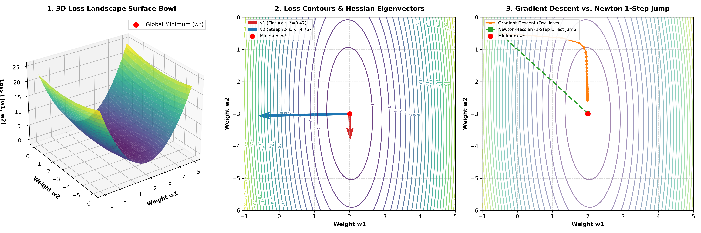

# Visualizing the Hessian Matrix & Loss Curvature

Personal exploration repo detailing the geometry of the Hessian matrix ($H = \frac{1}{N} X^T X$), loss landscapes, and 2nd-order optimization.

---

## 📐 Why 2D Input $\rightarrow$ 3D Loss Bowl?

Consider a simple linear projection mapping 2D inputs $x = [x_1, x_2]^T$ to a 1D scalar output $y$:
$$y = w_1 x_1 + w_2 x_2 = \mathbf{w}^T \mathbf{x}$$

- The parameter space is **2D** $(w_1, w_2)$.
- The Loss $L(w_1, w_2)$ is a **scalar (1D)**:
  $$L(w_1, w_2) = \frac{1}{2N} \sum_{i=1}^N (w_1 x_{i1} + w_2 x_{i2} - y_i)^2$$
- Plotting $z = L(w_1, w_2)$ yields a **3D Surface Bowl** (a paraboloid).

---

## 🔬 Calculus: Gradient vs. Hessian

### 1. Gradient Vector $\nabla L$ (First Derivatives)
Indicates the **steepest direction of increase** on the 3D loss surface:
$$\nabla L = \frac{1}{N} X^T (X \mathbf{w} - \mathbf{y})$$

### 2. Hessian Matrix $H$ (Second Derivatives)
Measures the **3D Curvature (rate of change of the gradient)**:
$$H = \begin{bmatrix} \frac{\partial^2 L}{\partial w_1^2} & \frac{\partial^2 L}{\partial w_1 \partial w_2} \\[4pt] \frac{\partial^2 L}{\partial w_2 \partial w_1} & \frac{\partial^2 L}{\partial w_2^2} \end{bmatrix} = \frac{1}{N} X^T X$$

---

## 💡 What Eigenvalues ($\lambda$) and Eigenvectors ($\mathbf{v}$) Tell Us

The eigen-decomposition of $H$ reveals the principal axes of the 3D loss bowl:
- **Eigenvector $\mathbf{v}_1$ (Direction)**: The direction of the valley floor or wall.
- **Eigenvalue $\lambda_1$ (Magnitude)**: The steepness of curvature in that direction.
  - Large $\lambda$: Extremely steep valley wall (high sensitivity).
  - Small $\lambda$: Very flat valley floor (low sensitivity).

---

## 🖼️ Visual Breakdown

1. **Panel 1 (3D Surface Bowl)**: Visualizes the 3D paraboloid $z = L(w_1, w_2)$ over weight space.
2. **Panel 2 (Contour Map & Eigenvectors)**: Displays elliptical loss contours with overlaid Hessian eigenvectors ($\mathbf{v}_1, \mathbf{v}_2$), scaled by their curvature eigenvalues ($\lambda_1, \lambda_2$).
3. **Panel 3 (Gradient Descent vs. Newton 1-Step Jump)**:
   - **Gradient Descent (Orange)**: Oscillates back and forth across the steep valley wall ($\lambda_2 = 4.75$) while making slow progress along the flat floor ($\lambda_1 = 0.47$).
   - **Newton-Hessian Jump (Green)**: Using $H^{-1} \nabla L$ accounts for both steepness and cross-coupling, jumping **straight to the global minimum in 1 step**:
     $$\mathbf{w}_{\text{newton}} = \mathbf{w}_0 - H^{-1} \nabla L$$

---

## 📂 File Layout

- [`hessian.py`](hessian.py): Clean Python script generating data, computing loss, gradient, Hessian matrix $H = \frac{1}{N} X^T X$, and eigenvalues/eigenvectors.
- [`plot.py`](plot.py): Generates the 3D surface plot, contour maps, and optimization trajectories.
