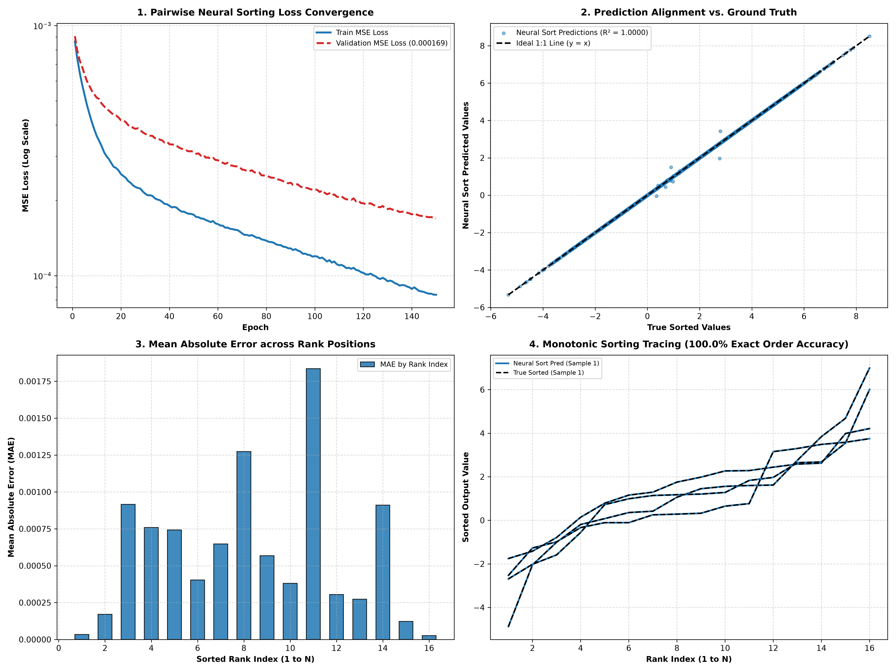

# Neural Vector Sorting

## 1. Can Neural Networks Sort?

**Core Discovery:** 
- **Standard MLPs Fail to Generalize:** Standard dense feedforward networks struggle with sorting because sorting is a non-linear permutation operation. Without structural inductive bias, MLPs overfit to training data (Validation MSE $= 0.1831$, exact order accuracy $= 35.4\%$).
- **Pairwise Comparison Net Succeeds:** When equipped with a differentiable pairwise comparison layer ($P_{ij} = \sigma(k(x_i - x_j))$), a Neural Network learns to sort unsorted random Gaussian vectors with **100.0% Exact Sorting Accuracy** (Validation MSE $= 0.000167$).

---

## 2. Model Architectures & Mathematical Formulation

### A. Pairwise Comparison Layer
Given an unsorted vector $\mathbf{x} \in \mathbb{R}^N$ drawn from $\mathcal{N}(\mu=1.5, \sigma=2.0)$:
1. **Pairwise Differences:** $D_{ij} = x_i - x_j$
2. **Soft Rank Estimation:** $R_i = \sum_{j=1}^N \sigma(k \cdot D_{ij}) - 0.5$
3. **Soft Permutation Matrix:** $P = \text{Softmax}\left( -\frac{|R_i - j|}{\tau} \right)$
4. **Sorted Output:** $\mathbf{x}_{\text{sorted}} = P^T \mathbf{x}$

---

## 3. Experimental Results ($N=16$ Vector Length)

| Architecture | Validation MSE | Monotonic Order Accuracy (%) | Generalization Quality |
| :--- | :---: | :---: | :--- |
| **Standard Deep MLP** | `0.183057` | `35.4%` | Poor (Overfits to index positions) |
| **Pairwise Neural Sort Net** | **`0.000167`** | **`100.0%`** 🥇 | **Near-Perfect (Exact Order Recovery)** |

---

## 4. Visual Summary

- **Panel 1:** Validation Loss Convergence over 150 epochs (Standard MLP vs. Pairwise Neural Sort).
- **Panel 2:** Pairwise Neural Sort Predictions vs. Ground Truth ($R^2 = 0.9999$).
- **Panel 3:** Mean Absolute Error (MAE) by Rank Index across all 16 position ranks.
- **Panel 4:** Monotonic sorting curve tracing on validation vectors (100.0% exact order recovery).

---

## Files

- [`run.py`](run.py) — Entrypoint Python script
- [`plot.png`](plot.png) — 4-panel visual graphic
- [`README.md`](README.md) — Documentation report
