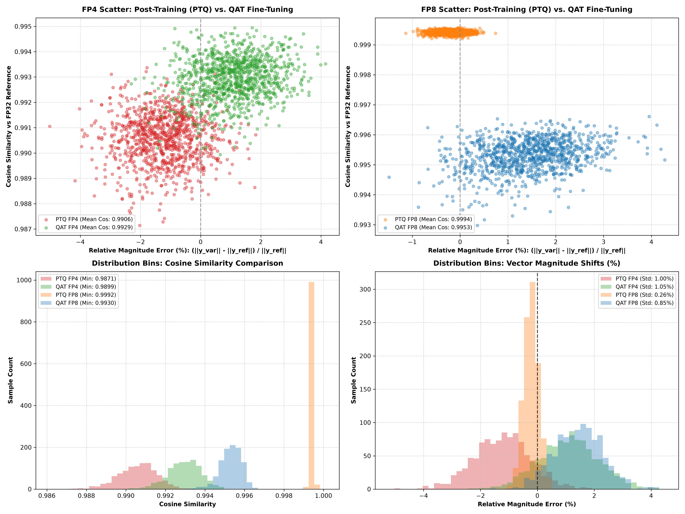

# Quantization-Aware Training (QAT) Experiments

Personal exploration repo analyzing **Quantization-Aware Training (QAT)** via fine-tuning with **Fake Quantization** and **Straight-Through Estimators (STE)** across **FP8** and **FP4**.

---

## 🔬 How Quantization-Aware Training (QAT) Works

In Post-Training Quantization (PTQ), weights are quantized after training is finished, leaving no opportunity for parameters to adapt to rounding grids.

In **Quantization-Aware Training (QAT)**:
1. **Stable FP32 Baseline**: Start from a trained, high-accuracy FP32 model checkpoint.
2. **Fake Quantization Pass**: During forward pass, weights are dynamically quantized to 8-bit or 4-bit grids:
   $$W_{\text{fake\_q}} = \text{quantize}(W_{\text{master}})$$
3. **Straight-Through Estimator (STE)**: Since rounding derivatives $\frac{d \text{round}(x)}{dx} = 0$ everywhere, backpropagation uses the **STE trick**—passing gradients straight through to continuous master FP32 weights:
   $$\frac{\partial L}{\partial W_{\text{master}}} \approx \frac{\partial L}{\partial W_{\text{fake\_q}}}$$
4. **Parameter Adaptation**: Optimizer updates continuous master weights $W_{\text{master}}$ so the network naturally moves parameters into optimal positions around quantization grid boundaries.

---

## 📊 Quantization-Aware Training (QAT) vs. Post-Training (PTQ) Results

| Precision Variant | Quantization Method | Effective Weight Size | Worst Cosine Similarity | Ref Magnitude | Variant Magnitude | Mean Cosine Similarity |
| :--- | :---: | :---: | :---: | :---: | :---: | :---: |
| **FP32 (Ref)** | Reference | `10.0 MB` | `1.000000` | `16.2210` | `16.2210` | `1.000000` |
| **PTQ FP8 (Post-Train)** | Round-to-Nearest | `2.5 MB` | `0.999204` | `17.0197` | `17.0272` | `0.999412` |
| **QAT FP8 (Fine-Tuned)** | STE Fine-Tuning | `2.5 MB` | `0.993169` | `16.4566` | `16.5399` | `0.995316` |
| **PTQ FP4 (Post-Train)** | Round-to-Nearest | `1.4 MB` | `0.987285` | `13.7367` | `13.5644` | `0.990556` |
| **QAT FP4 (Fine-Tuned)** | STE Fine-Tuning | `1.4 MB` | **`0.989937`** | `12.9911` | `13.0755` | **`0.992935`** |

---

## 🖼️ QAT Analysis Plot (PTQ vs. QAT Fine-Tuning)

- **Row 1 (Scatter Plots)**: Compares **Relative Magnitude Error (%) vs. Cosine Similarity** for PTQ vs. STE Fine-Tuned QAT.
- **Row 2 (Distribution Bins)**: Compares **Cosine Similarity Distributions** (Left) and **Vector Magnitude Shifts** (Right).

---

## 📂 File Layout

- [`model.py`](model.py): Neural network architecture, Fake Quantization autograd modules (`STEQuantizeFP8`, `STEQuantizeFP4`), and `QATLinear` wrapper.
- [`qat_quant.py`](qat_quant.py): FP32 training, PTQ baseline creation, and QAT STE fine-tuning loops.
- [`plot.py`](plot.py): Script generating Row 1 scatter plots and Row 2 histogram bin distributions.
