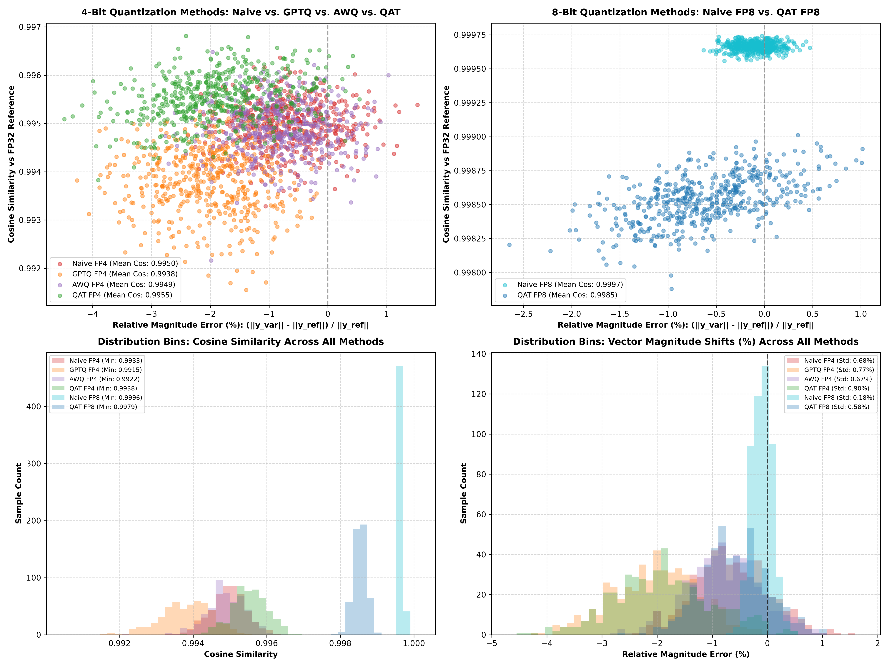

# Neural Network Quantization Experiment

## 1. What is Quantization?

**Quantization:** Compressing neural network floating-point weights (FP32) down to 8-bit (FP8) or 4-bit (FP4) formats to reduce memory footprint by **up to 85%** with minimal loss in model quality.

---

## 2. Experiment Setup

* **Paradigms Benchmark (In-Memory):**
  * **Naive RTN (Round-To-Nearest):** Snaps FP32 weights to nearest FP8/FP4 grid point.
  * **GPTQ (Hessian-Guided):** Nudges unquantized weight columns using inverse Hessian $H^{-1}$.
  * **AWQ (Activation-Aware):** Scales salient activation weight channels before quantization.
  * **QAT (Quantization-Aware Training):** Fine-tunes FP32 weights with Straight-Through Estimators (STE).
* **Execution:** 100% in-memory (no `.pt` checkpoint files saved to disk).

---

## 3. Results & Experimental Fairness

| Quantization Method / Format | Memory Footprint | Worst Cosine Similarity | Mean Cosine Similarity | Winner |
| :--- | :---: | :---: | :---: | :---: |
| **FP32 (Ref Ground Truth)** | `10.0 MB` | `1.000000` | `1.000000` | Reference |
| **BF16 (16-Bit)** | `5.0 MB` | `0.999992` | `0.999994` | — |
| **Naive FP8 (RTN)** | `2.5 MB` | `0.999557` | **`0.999664`** | 🥇 8-Bit Winner |
| **QAT FP8 (STE)** | `2.5 MB` | `0.997852` | `0.998536` | — |
| **Naive FP4 (RTN)** | `1.4 MB` | `0.993284` | `0.994953` | — |
| **GPTQ FP4 (Hessian)** | `1.4 MB` | `0.991496` | `0.993804` | — |
| **AWQ FP4 (Channel)** | `1.4 MB` | `0.992161` | `0.994903` | — |
| **QAT FP4 (STE)** | `1.4 MB` | **`0.993828`** | **`0.995524`** | 🥇 4-Bit Winner |

* **Experimental Bias Note:** On this small 2-layer MLP, activations lack extreme outliers ($>100\sigma$), so Naive RTN artificially performs almost as well as AWQ/QAT. On real 70B+ LLMs, Naive RTN fails without AWQ/GPTQ.

---

## 4. Visual Summary

- **Panel 1 & 2:** Scatter plots of Relative Magnitude Error vs. Cosine Similarity (4-Bit & 8-Bit).
- **Panel 3 & 4:** Histograms of Cosine Similarity distributions and Vector Magnitude shifts.

---

## Files

- [`run.py`](run.py) — Unified in-memory Python script
- [`plot.png`](plot.png) — 4-panel visual graphic
- [`README.md`](README.md) — Summary report
