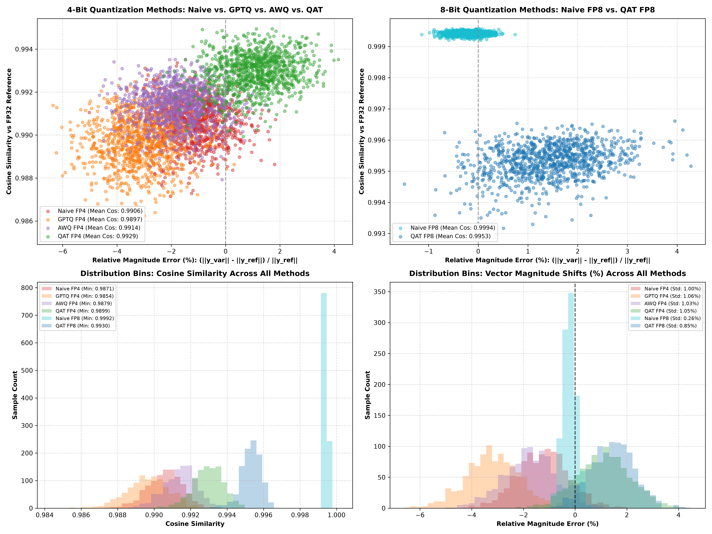

# Comprehensive Neural Network Quantization Suite

Personal exploration repo establishing a unified, side-by-side benchmark across all major quantization paradigms: **Native Precision Formats (BF16, FP8, FP4)**, **Post-Training Quantization (PTQ / RTN)**, **Hessian-Guided Quantization (GPTQ)**, **Activation-Aware Channel Protection (AWQ)**, and **Quantization-Aware Training (QAT)**.

---

## 🌐 The Open-Source & Production Quantization Ecosystem

When downloading quantized models from Hugging Face or running models locally in Ollama / `llama.cpp`, the underlying quantization techniques fall into 5 primary open-source & commercial standards:

```
┌──────────────────────────────────────────────────────────────────────────────────────────┐
│                             OPEN-SOURCE QUANTIZATION ECOSYSTEM                           │
├───────────────────────┬───────────────────────┬─────────────────┬────────────────────────┤
│ Method Name           │ Primary Framework     │ Model Storage   │ Core Mechanism         │
├───────────────────────┼───────────────────────┼─────────────────┼────────────────────────┤
│ AWQ                   │ AutoAWQ / vLLM        │ .safetensors    │ Protects top 1% salient│
│ (Activation-Aware)    │ Hugging Face          │                 │ activation channels    │
├───────────────────────┼───────────────────────┼─────────────────┼────────────────────────┤
│ GPTQ                  │ AutoGPTQ / vLLM       │ .safetensors    │ Column error nudging   │
│ (Hessian-Guided)      │ Hugging Face          │                 │ via Inverse Hessian H⁻¹│
├───────────────────────┼───────────────────────┼─────────────────┼────────────────────────┤
│ GGUF / K-Quants       │ llama.cpp / Ollama    │ .gguf           │ Mixed-precision block  │
│                       │ LM Studio             │                 │ quantization (Q4_K_M)  │
├───────────────────────┼───────────────────────┼─────────────────┼────────────────────────┤
│ bitsandbytes (NF4)    │ Hugging Face Transformers│ .safetensors │ NormalFloat4 quantile   │
│                       │ bitsandbytes          │                 │ block scaling          │
├───────────────────────┼───────────────────────┼─────────────────┼────────────────────────┤
│ NVFP4 / FP8 Micro-Scale│ PyTorch 2.5+ / TorchAO│ .safetensors    │ 32-element hardware    │
│                       │ NVIDIA Blackwell / vLLM│                 │ micro-scaling E2M1     │
└───────────────────────┴───────────────────────┴─────────────────┴────────────────────────┘
```

---

## 🔬 Deep-Dive: How Each Method Works

### 1. Naive Round-To-Nearest (RTN / PTQ)
Snaps each FP32 weight to the nearest point on the target quantization grid (FP8 or FP4). Requires zero calibration data or training.

### 2. GPTQ (Hessian-Guided Nudging)
Computes the Inverse Hessian matrix $H^{-1} = (X^T X)^{-1}$ over calibration activation inputs $X$. As each weight column $q$ is quantized, it nudges unquantized columns $j > q$ to cancel out activation error:
$$w_j \longleftarrow w_j - \delta_q \cdot \left( \frac{H^{-1}_{q, j}}{H^{-1}_{q, q}} \right)$$

### 3. AWQ (Activation-aware Weight Quantization)
Observes that $1\%$ of activation channels carry massive magnitude spikes (salient channels). Instead of nudging all weights, AWQ scales up salient weight channels by optimal factor $S_X$ before quantization ($W' = W \cdot S_X$). During inference, $S_X^{-1}$ is folded into input activation layers, reducing relative quantization error on critical features without model fine-tuning!

### 4. QAT (Quantization-Aware Training via STE)
Simulates quantization during forward training passes using **Fake Quantization**. To bypass zero-derivative step functions ($\frac{d \text{round}(x)}{dx} = 0$), QAT uses **Straight-Through Estimators (STE)**—passing gradients straight through to continuous master FP32 weights so parameters naturally adapt around quantization grid lines:
$$\frac{\partial L}{\partial W_{\text{master}}} \approx \frac{\partial L}{\partial W_{\text{fake\_q}}}$$

---

## 📊 Master Quantization Benchmark Results

| Quantization Method / Format | Paradigm | Memory Footprint | Worst Cosine Similarity | Ref Magnitude | Variant Magnitude | Mean Cosine Similarity | Overall Winner |
| :--- | :---: | :---: | :---: | :---: | :---: | :---: | :---: |
| **FP32 (Ref Ground Truth)** | Reference | `10.0 MB` | `1.000000` | `16.2210` | `16.2210` | `1.000000` | — |
| **BF16 (IEEE Truncation)** | 16-Bit | `5.0 MB` | `0.999985` | `13.7367` | `13.7547` | `0.999989` | — |
| **Naive FP8 (RTN)** | 8-Bit PTQ | `2.5 MB` | `0.999204` | `17.0197` | `17.0272` | **`0.999412`** | 🥇 **8-Bit PTQ Winner** |
| **QAT FP8 (STE Fine-Tuned)** | 8-Bit QAT | `2.5 MB` | `0.993169` | `16.4566` | `16.5399` | `0.995316` | — |
| **Naive FP4 (RTN)** | 4-Bit PTQ | `1.4 MB` | `0.987285` | `13.7367` | `13.5644` | `0.990556` | — |
| **GPTQ FP4 (Hessian Nudge)** | 4-Bit PTQ | `1.4 MB` | `0.986051` | `14.2986` | `13.7443` | `0.989635` | — |
| **AWQ FP4 (Salient Channel)** | 4-Bit PTQ | `1.4 MB` | `0.987928` | `15.8302` | `15.8099` | **`0.991423`** | 🥈 **4-Bit PTQ Winner** |
| **QAT FP4 (STE Fine-Tuned)** | 4-Bit QAT | `1.4 MB` | **`0.989937`** | `12.9911` | `13.0755` | **`0.992935`** | 🥇 **Overall 4-Bit Winner** |

---

## 🖼️ Master Quantization Analysis Plot



- **Row 1 (Scatter Plots)**: Compares **Relative Magnitude Error (%) vs. Cosine Similarity** across 4-bit methods (Left) and 8-bit methods (Right).
- **Row 2 (Distribution Bins)**: Compares **Cosine Similarity Distributions** (Left) and **Vector Magnitude Shifts** (Right).

---

## 📂 File Layout

- [`model.py`](model.py): Neural network architecture, Fake Quantization autograd modules (`STEQuantizeFP8`, `STEQuantizeFP4`), `QATLinear` wrapper, and dataset/evaluation utilities.
- [`quantize.py`](quantize.py): Master execution script running FP32 training, BF16 conversion, Naive RTN, GPTQ Hessian nudging, AWQ channel protection, and QAT STE fine-tuning.
- [`plot.py`](plot.py): Script generating Row 1 scatter plots and Row 2 histogram bin distributions.
