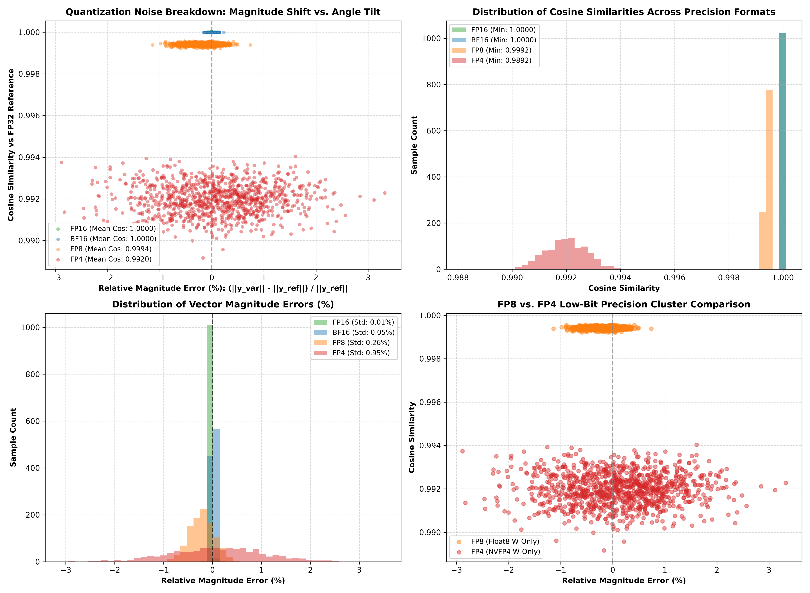

# TorchAO & Manual Quantization Experiments

Personal exploration repo for analyzing post-training quantization (FP32, FP16, BF16, FP8, FP4) using PyTorch Architecture Optimization (`torchao`) and pure step-by-step tensor math implementations.

---

## 🔍 How Quantization Works Under the Hood

### 1. FP16 & BF16 (Half Precision & Brain Float)
- **FP16**: Direct IEEE 754 16-bit float truncation (`weight.half()`).
- **BF16**: Retains the 8-bit exponent of FP32 while truncating mantissa bits (`weight.bfloat16()`).

### 2. FP8 (Float8 Weight-Only: `float8_e4m3fn`)
Per-row scale calculation over weight matrix $W$:
$$S_r = \frac{\max(|W_r|)}{448.0}$$
$$W_q = \text{clamp}\left(\frac{W}{S_r}\right) \xrightarrow{\text{cast}} \text{float8\_e4m3fn}$$
$$\hat{W} = \text{float32}(W_q) \times S_r$$

### 3. FP4 (Microscaling E2M1: 4-Bit Block Quantization)
Per-block scale calculation over 32-element chunks $W_b$:
$$S_b = \frac{\max(|W_b|)}{6.0}$$
$$W_q = \text{NearestGrid}\left(\frac{W_b}{S_b}\right), \quad \text{Grid} \in \{0, \pm 0.5, \pm 1.0, \pm 1.5, \pm 2.0, \pm 3.0, \pm 4.0, \pm 6.0\}$$
$$\hat{W} = W_q \times S_b$$

---

## 📐 Geometric Insight: Concentration of Measure
In high-dimensional spaces ($d=256$), random quantization noise $\Delta y = x \Delta W$ is statistically orthogonal to the output signal $y_{\text{ref}}$. As a result:
- Quantization noise primarily causes a tiny **angular tilt** ($\theta$), keeping **Cosine Similarity $> 0.991$** even at 4-bit precision.
- Block scale factors prevent systematic magnitude collapse.

---

## 📊 Results Summary

| Variant | Size (MB) | Reduction | Worst Cos Sim | Ref Mag | Variant Mag | Mean Cos Sim |
| :--- | :---: | :---: | :---: | :---: | :---: | :---: |
| **FP32 (Ref)** | `10.00 MB` | `0.0%` | `1.000000` | `16.2210` | `16.2210` | `1.000000` |
| **FP16** | `5.00 MB` | `50.0%` | `1.000000` | `19.1464` | `19.1467` | `1.000000` |
| **BF16** | `5.00 MB` | `50.0%` | `0.999985` | `13.7367` | `13.7547` | `0.999989` |
| **FP8 (TorchAO)** | `2.52 MB` | `74.8%` | `0.999204` | `17.0197` | `17.0272` | `0.999412` |
| **FP4 (TorchAO)** | `1.41 MB` | `85.9%` | `0.989612` | `14.5345` | `14.3768` | `0.991975` |

---

## 🖼️ Quantization Noise Distribution & Scatter Plot

---

## 📂 File Layout

- [`model.py`](model.py): Neural network model architecture & dataset generator.
- [`torchao_quant.py`](torchao_quant.py): FP32 training and `torchao` quantization transforms.
- [`manual_quant.py`](manual_quant.py): Step-by-step tensor quantization math without framework abstractions.
- [`plot.py`](plot.py): Generates scatter plots and probability density distributions.
