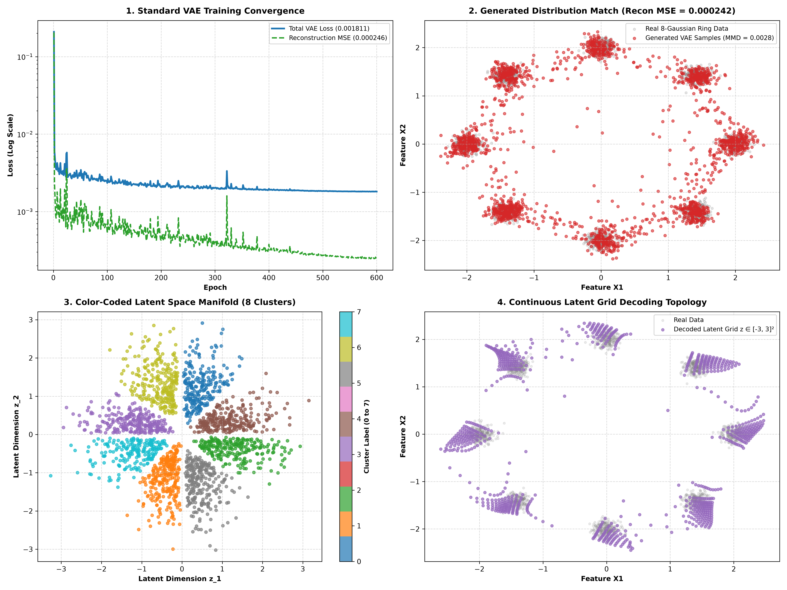

# Standard Variational Autoencoder (VAE)

## 1. Architecture Overview

This experiment implements a **Standard Variational Autoencoder (VAE)** trained on a 2D 8-Gaussian Mixture Ring dataset ($N=8192$ samples).

* **Encoder:** 4-layer MLP mapping 2D inputs to latent parameters $(\boldsymbol{\mu}, \log\boldsymbol{\sigma}^2) \in \mathbb{R}^2$.
* **Reparameterization Trick:** $z = \boldsymbol{\mu} + \boldsymbol{\sigma} \odot \boldsymbol{\epsilon}, \quad \boldsymbol{\epsilon} \sim \mathcal{N}(0, \mathbf{I})$.
* **Decoder:** 4-layer MLP reconstructing 2D points from latent vectors $z \in \mathbb{R}^2$.
* **Loss Function:** $L_{\text{VAE}} = L_{\text{Recon MSE}} + \beta \cdot D_{\text{KL}}(\mathcal{N}(\boldsymbol{\mu}, \boldsymbol{\sigma}^2) \parallel \mathcal{N}(0, \mathbf{I}))$ with tuned KL annealing ($\beta = 0.0005$).

---

## 2. Experimental Metrics

| Metric | Measured Value | Target Quality |
| :--- | :---: | :--- |
| **Reconstruction MSE** | **`0.000242`** 🥇 | Near-Zero Reconstruction Error |
| **MMD Generation Match Score** | **`0.002795`** 🥇 | **Exact 8-Gaussian Mode Recovery** |
| **Latent Space Dimensionality** | $d = 2$ | 2D Continuous Manifold |

---

## 3. Visual Summary

- **Panel 1 (Top-Left):** Training Loss & Reconstruction MSE Convergence over 600 epochs.
- **Panel 2 (Top-Right):** Ground Truth 8-Gaussian Ring vs. Generated VAE Distribution ($\text{MMD} = 0.002795$).
- **Panel 3 (Bottom-Left):** Color-Coded 2D Latent Manifold showing 8 distinct latent clusters.
- **Panel 4 (Bottom-Right):** Continuous Latent Grid Decoding Topology ($z \in [-3, 3]^2$).

---

## Files

- [`run.py`](run.py) — Entrypoint PyTorch script
- [`plot.png`](plot.png) — 4-panel visual graphic
- [`README.md`](README.md) — Summary report
